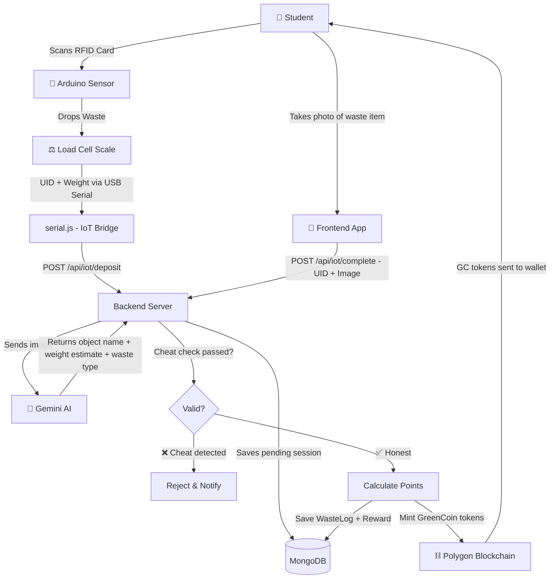
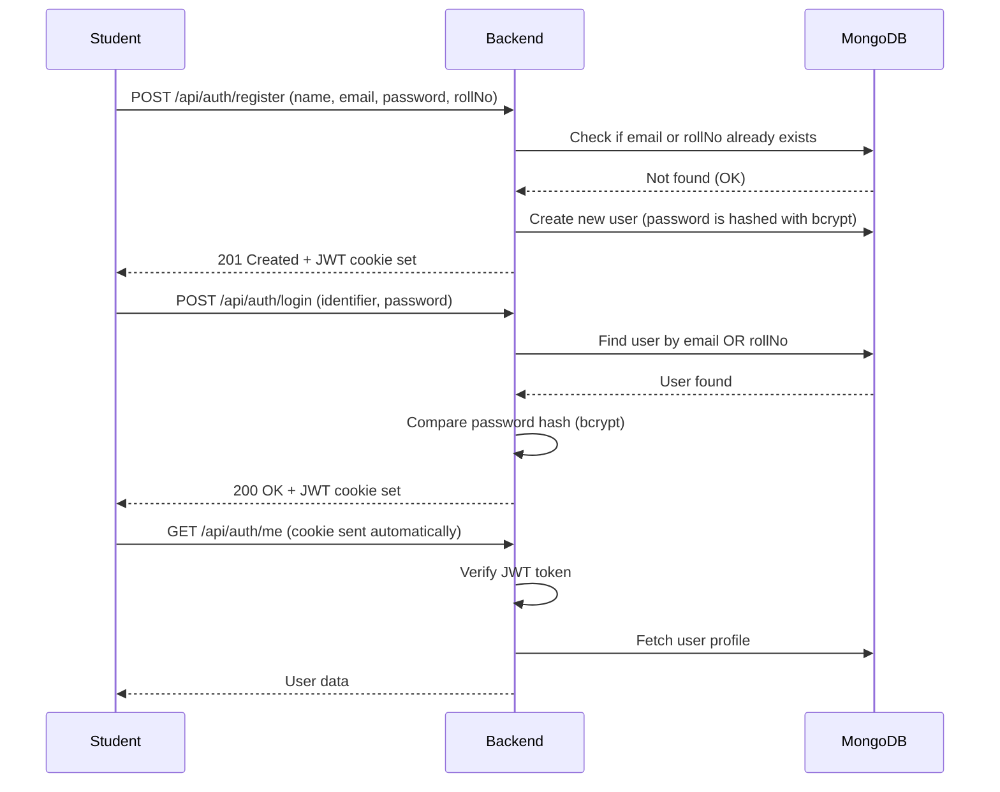
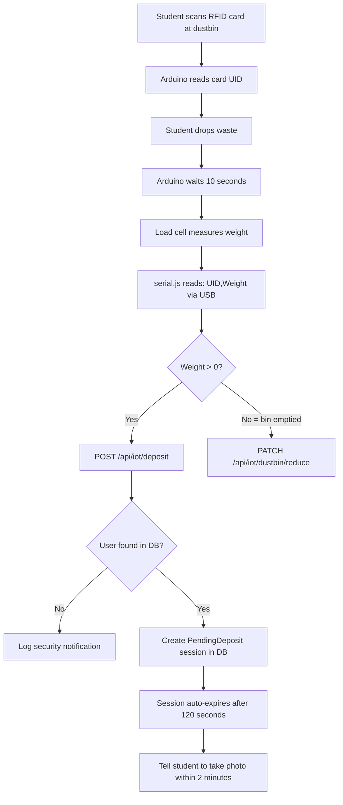
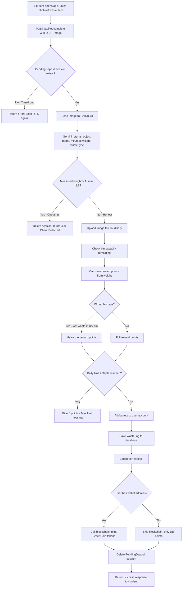
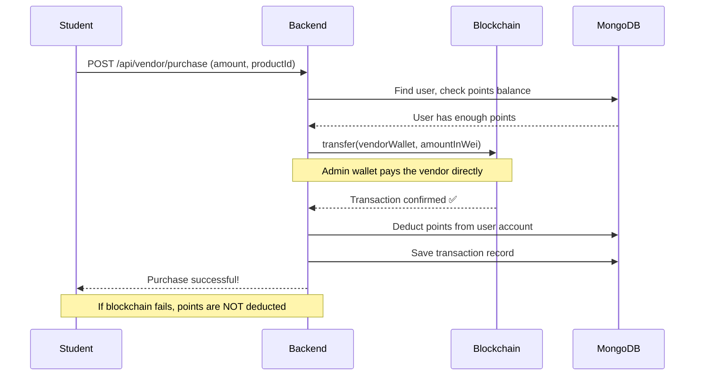
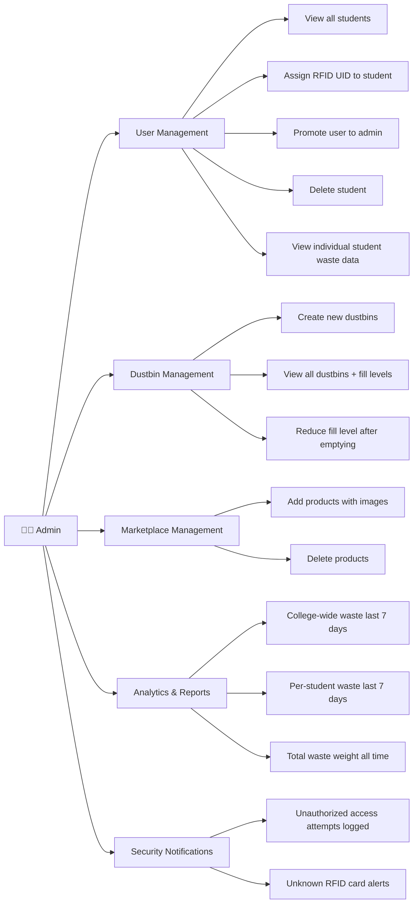

# 🌿 GreenCoin Backend

> The brain of the Smart Waste Management System — a Node.js REST API that handles user authentication, IoT data processing, AI-powered waste verification, blockchain rewards, and admin management.

---

## 📖 Table of Contents

- [What Does the Backend Do?](#what-does-the-backend-do)
- [Tech Stack](#tech-stack)
- [Project Structure](#project-structure)
- [How It All Works (System Overview)](#how-it-all-works-system-overview)
- [Core Feature Flows](#core-feature-flows)
  - [1. User Registration & Login](#1-user-registration--login)
  - [2. Waste Deposit Flow (IoT + AI + Blockchain)](#2-waste-deposit-flow-iot--ai--blockchain)
  - [3. Marketplace Purchase Flow](#3-marketplace-purchase-flow)
  - [4. Admin Operations](#4-admin-operations)
- [API Reference](#api-reference)
- [Reward Calculation Logic](#reward-calculation-logic)
- [Environment Variables](#environment-variables)
- [Running Locally](#running-locally)

---

## What Does the Backend Do?

Think of the backend as the **central hub** that connects four different worlds:

| World | What Happens |
|-------|-------------|
| 🏫 **Students** | Register, login, deposit waste, earn points |
| 🤖 **IoT Sensor** | Sends RFID card ID + waste weight to the backend |
| 🧠 **AI (Gemini)** | Verifies the photo of waste to prevent cheating |
| ⛓️ **Blockchain** | Mints GreenCoin tokens to student wallets as rewards |

---

## Tech Stack

| Tool | Purpose |
|------|---------|
| **Node.js + Express 5** | Web server & REST API |
| **MongoDB + Mongoose** | Database for users, waste logs, products |
| **JWT (JSON Web Tokens)** | Secure user authentication via cookies |
| **bcryptjs** | Password hashing |
| **Google Gemini AI** | Vision AI to classify & weigh waste from photos |
| **ethers.js v6** | Connect to Ethereum blockchain |
| **Cloudinary** | Store waste deposit images |
| **SerialPort** | Read data from the Arduino over USB |
| **node-cron** | Scheduled daily reset of usage limits |
| **Multer** | Handle image uploads |

---

## Project Structure

```
green-coin-backend/
├── server.js              ← Entry point, starts the server
├── serial.js              ← IoT bridge: reads Arduino data via USB serial
├── src/
│   ├── app.js             ← Express app: middleware + route registration
│   ├── config/
│   │   └── database.js    ← MongoDB connection setup
│   ├── controller/        ← Business logic for each feature
│   │   ├── auth.controller.js
│   │   ├── admin.controller.js
│   │   ├── wasteLog.controller.js   ← Core: IoT + AI + Blockchain
│   │   ├── vendor.controller.js
│   │   ├── analytics.controller.js
│   │   ├── leaderboard.controller.js
│   │   ├── product.controller.js
│   │   ├── transaction.controller.js
│   │   └── user.controller.js
│   ├── models/            ← MongoDB data schemas
│   │   ├── user.model.js
│   │   ├── dustbin.model.js
│   │   ├── waste.model.js
│   │   ├── reward.model.js
│   │   ├── pendingDeposit.model.js
│   │   ├── transaction.model.js
│   │   ├── product.model.js
│   │   └── notification.model.js
│   ├── routes/            ← URL path definitions
│   ├── middleware/        ← Auth guard (JWT verification)
│   ├── services/
│   │   └── gemini.service.js   ← Talks to Google Gemini AI
│   └── utils/
│       ├── blockchain.js        ← Sends/transfers GreenCoin tokens
│       ├── rewardCalculator.js  ← Points formula based on weight
│       ├── cloudinary.js        ← Image upload helper
│       └── resetWastedroppedToday.js  ← Daily cron job
```

---

## How It All Works (System Overview)



---

## Core Feature Flows

### 1. User Registration & Login



**Key Points:**
- Login works with **email OR roll number** (flexible authentication)
- Passwords are **never stored as plain text** — bcrypt hashes them
- JWT token is stored in an **httpOnly cookie** (not accessible to JavaScript, more secure)
- Token expires in **7 days**

---

### 2. Waste Deposit Flow (IoT + AI + Blockchain)

This is the most complex and unique part of the project. It has **two steps**:

#### Step 1 — Arduino sends RFID + Weight



#### Step 2 — Frontend sends Photo for AI Verification



**Anti-Cheat System:**
> The Gemini AI looks at the waste item photo and estimates how heavy that item should really weigh. If the sensor measured weight is **more than 1.5× the AI's maximum estimate**, the system flags it as cheating (e.g., putting rocks inside a plastic bottle) and **rejects the deposit entirely**.

**Wrong Bin Penalty:**
> If a student puts **wet waste (food scraps)** into a **dry waste bin**, they still get rewarded — but only **half the points**. This encourages proper waste segregation.

---

### 3. Marketplace Purchase Flow



**Key Design:** Points are **only deducted from the database AFTER** the blockchain transaction succeeds. This ensures the student never loses points without a real transaction happening.

---

### 4. Admin Operations



---

## API Reference

### 🔐 Authentication (`/api/auth`)

| Method | Endpoint | Description | Auth Required |
|--------|----------|-------------|:---:|
| `POST` | `/register` | Register a new student | ❌ |
| `POST` | `/login` | Login with email or roll number | ❌ |
| `GET` | `/me` | Get logged-in user's profile | ✅ |

### 🗑️ IoT / Waste (`/api/iot`)

| Method | Endpoint | Description | Auth Required |
|--------|----------|-------------|:---:|
| `POST` | `/deposit` | Step 1: Arduino sends UID + weight | ❌ (IoT device) |
| `POST` | `/complete` | Step 2: App sends UID + photo | ❌ (IoT device) |
| `POST` | `/dustbin` | Create a new dustbin (Admin only) | ✅ Admin |
| `GET` | `/dustbins` | Get all dustbins | ✅ Admin |
| `PATCH` | `/dustbin/reduce` | Reduce fill level after emptying | ✅ Admin |

### 👩‍💼 Admin (`/api/admin`)

| Method | Endpoint | Description |
|--------|----------|-------------|
| `GET` | `/students` | Get all student accounts |
| `GET` | `/students/:id` | Get one student's details |
| `PUT` | `/students/:id/uid` | Assign RFID UID to student |
| `DELETE` | `/students/:id` | Delete a student |
| `PUT` | `/students/:id/promote` | Promote student to admin |
| `POST` | `/products` | Add marketplace product |
| `DELETE` | `/products/:id` | Remove product |
| `GET` | `/notifications` | View security alerts |

### 📊 Analytics (`/api/analytics`)

| Method | Endpoint | Description |
|--------|----------|-------------|
| `GET` | `/college/last-7-days` | College-wide waste data (last 7 days) |
| `GET` | `/user/last-7-days` | Logged-in user's waste (last 7 days) |
| `GET` | `/user/:id/last-7-days` | Specific student's waste (Admin) |
| `GET` | `/total-weight` | All-time total waste collected |

### 🛒 Vendor / Marketplace (`/api/vendor`)

| Method | Endpoint | Description |
|--------|----------|-------------|
| `POST` | `/purchase` | Buy a product using GreenCoin tokens |

### 🏆 Leaderboard (`/api/leaderboard`)

| Method | Endpoint | Description |
|--------|----------|-------------|
| `GET` | `/` | Top students ranked by points |

---

## Reward Calculation Logic

Points are awarded based on the **weight of waste deposited** (in grams):

| Weight Range | Points Earned |
|-------------|:---:|
| 1g – 9g | 2 pts |
| 10g – 19g | 10 pts |
| 20g – 49g | 20 pts |
| 50g – 99g | 40 pts |
| 100g – 199g | 80 pts |
| 200g – 300g | 120 pts |
| Less than 1g | 0 pts (noise) |
| More than 300g | 0 pts (rejected) |

**Daily Limit:** Maximum **200 points per student per day** to prevent abuse.

**Wrong Bin Penalty:** If AI detects wrong waste type for the bin → **reward is halved**.

---

## Environment Variables

Create a `.env` file in the root of `green-coin-backend/`:

```env
# Server
PORT=3000

# Database
MONGO_URI=mongodb+srv://<user>:<password>@cluster.mongodb.net/greencoin

# Authentication
JWT_SECRET=your_super_secret_key

# AI
GEMINI_API_KEY=your_google_gemini_api_key

# Blockchain
RPC_URL=https://polygon-amoy.g.alchemy.com/v2/your_key
PRIVATE_KEY=your_admin_wallet_private_key
CONTRACT_ADDRESS=0xYourDeployedContractAddress
VENDOR_WALLET=0xVendorWalletAddress

# Image Storage
CLOUDINARY_CLOUD_NAME=your_cloud_name
CLOUDINARY_API_KEY=your_key
CLOUDINARY_API_SECRET=your_secret

# IoT Bridge
SERIAL_PORT=COM3
DUSTBIN_ID=mongo_objectid_of_the_dustbin
```

---

## Running Locally

### Prerequisites
- Node.js 18+
- MongoDB Atlas account (or local MongoDB)
- Arduino connected via USB (for IoT)

### Steps

```bash
# 1. Install dependencies
npm install

# 2. Create your .env file (see above)

# 3. Start the backend API server
npm run dev

# 4. In a separate terminal, start the IoT serial bridge
npm run iot
```

The server runs on `http://localhost:3000` by default.

> ⚠️ **Note:** `npm run iot` (serial.js) must run **alongside** the main server. It listens to the Arduino on USB and forwards readings to the API.
