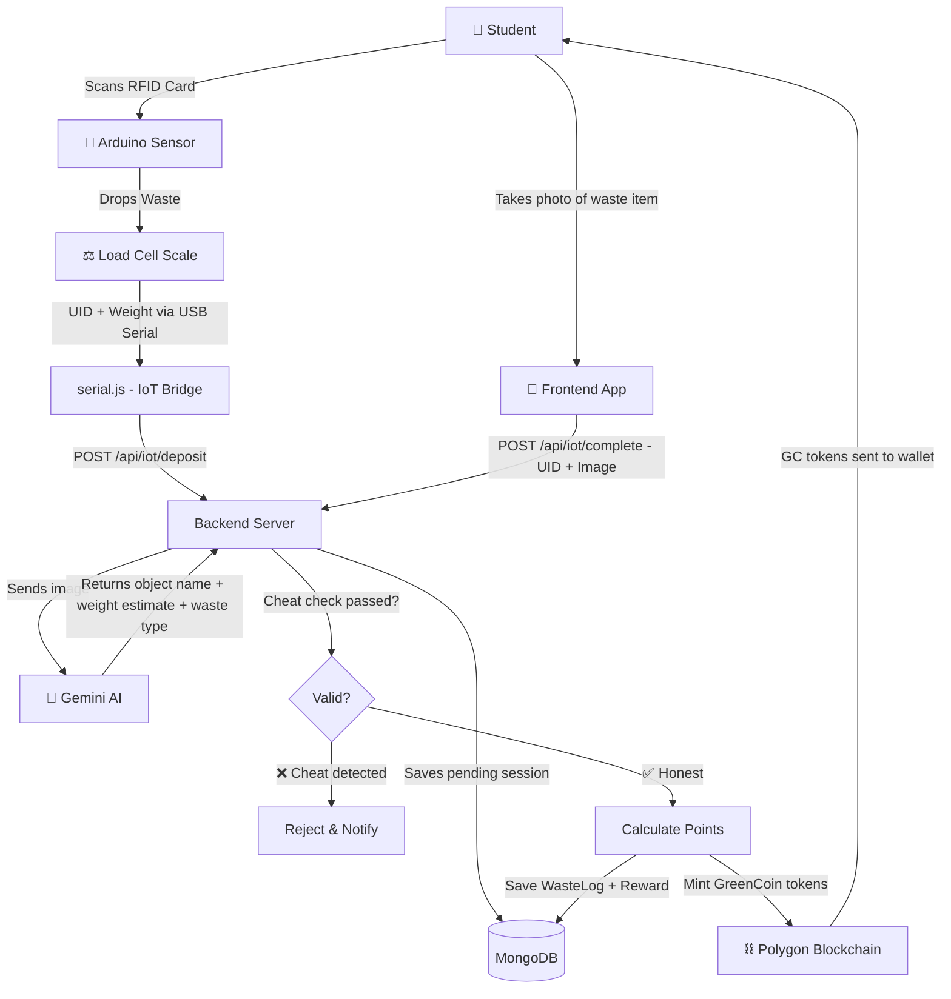
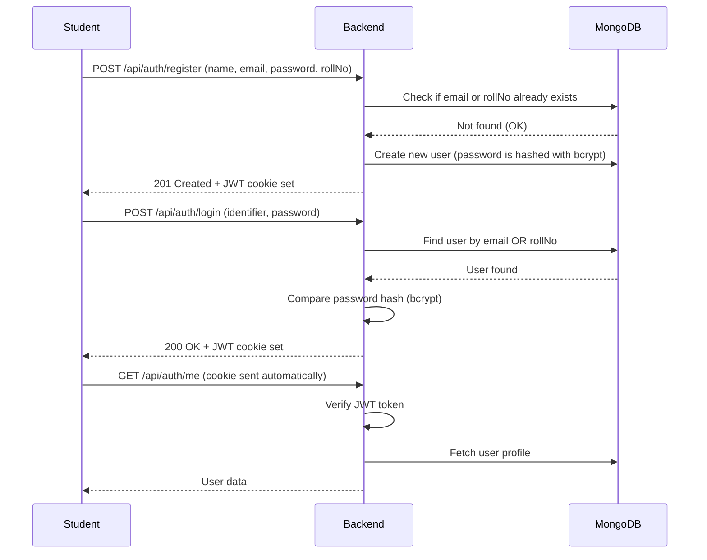
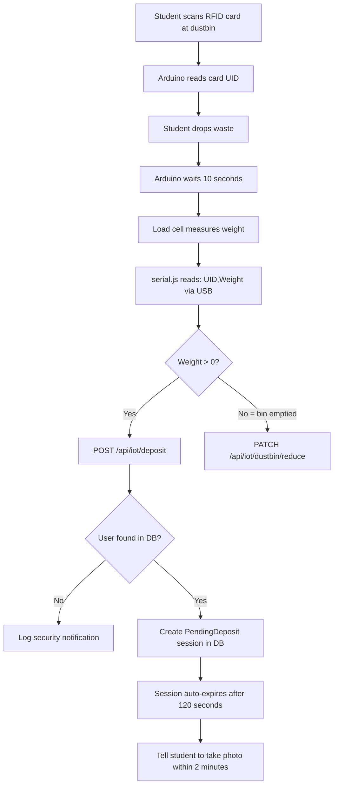
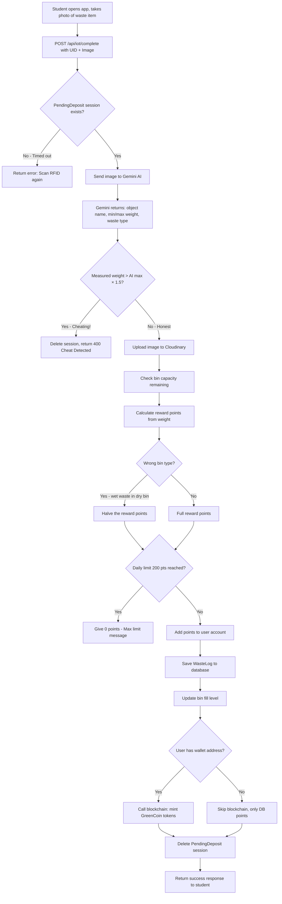
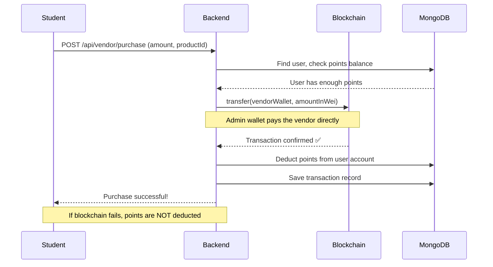
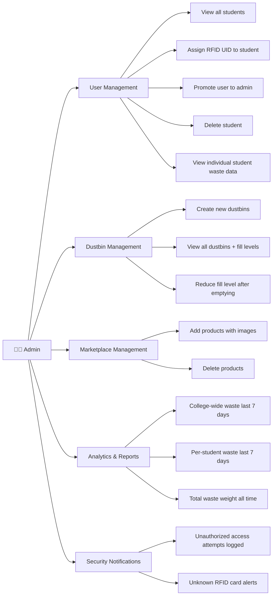

# 🌿 GreenCoin Backend

> The brain of the Smart Waste Management System — a Node.js REST API that handles user authentication, IoT data processing, AI-powered waste verification, blockchain rewards, and admin management.

---

## 📖 Table of Contents

- [What Does the Backend Do?](#what-does-the-backend-do)
- [Tech Stack](#tech-stack)
- [Project Structure](#project-structure)
- [How It All Works (System Overview)](#how-it-all-works-system-overview)
- [Core Feature Flows](#core-feature-flows)
  - [1. User Registration & Login](#1-user-registration--login)
  - [2. Waste Deposit Flow (IoT + AI + Blockchain)](#2-waste-deposit-flow-iot--ai--blockchain)
  - [3. Marketplace Purchase Flow](#3-marketplace-purchase-flow)
  - [4. Admin Operations](#4-admin-operations)
- [API Reference](#api-reference)
- [Detailed API Endpoints](#detailed-api-endpoints)
- [Error Handling](#error-handling)
- [Reward Calculation Logic](#reward-calculation-logic)
- [Environment Variables](#environment-variables)
- [Running Locally](#running-locally)

---

## What Does the Backend Do?

Think of the backend as the **central hub** that connects four different worlds:

| World | What Happens |
|-------|-------------|
| 🏫 **Students** | Register, login, deposit waste, earn points |
| 🤖 **IoT Sensor** | Sends RFID card ID + waste weight to the backend |
| 🧠 **AI (Gemini)** | Verifies the photo of waste to prevent cheating |
| ⛓️ **Blockchain** | Mints GreenCoin tokens to student wallets as rewards |

---

## Tech Stack

| Tool | Purpose |
|------|---------|
| **Node.js + Express 5** | Web server & REST API |
| **MongoDB + Mongoose** | Database for users, waste logs, products |
| **JWT (JSON Web Tokens)** | Secure user authentication via cookies |
| **bcryptjs** | Password hashing |
| **Google Gemini AI** | Vision AI to classify & weigh waste from photos |
| **ethers.js v6** | Connect to Ethereum blockchain |
| **Cloudinary** | Store waste deposit images |
| **SerialPort** | Read data from the Arduino over USB |
| **node-cron** | Scheduled daily reset of usage limits |
| **Multer** | Handle image uploads |

---

## Project Structure

```
green-coin-backend/
├── server.js              ← Entry point, starts the server
├── serial.js              ← IoT bridge: reads Arduino data via USB serial
├── src/
│   ├── app.js             ← Express app: middleware + route registration
│   ├── config/
│   │   └── database.js    ← MongoDB connection setup
│   ├── controller/        ← Business logic for each feature
│   │   ├── auth.controller.js
│   │   ├── admin.controller.js
│   │   ├── wasteLog.controller.js   ← Core: IoT + AI + Blockchain
│   │   ├── vendor.controller.js
│   │   ├── analytics.controller.js
│   │   ├── leaderboard.controller.js
│   │   ├── product.controller.js
│   │   ├── transaction.controller.js
│   │   └── user.controller.js
│   ├── models/            ← MongoDB data schemas
│   │   ├── user.model.js
│   │   ├── dustbin.model.js
│   │   ├── waste.model.js
│   │   ├── reward.model.js
│   │   ├── pendingDeposit.model.js
│   │   ├── transaction.model.js
│   │   ├── product.model.js
│   │   └── notification.model.js
│   ├── routes/            ← URL path definitions
│   ├── middleware/        ← Auth guard (JWT verification)
│   ├── services/
│   │   └── gemini.service.js   ← Talks to Google Gemini AI
│   └── utils/
│       ├── blockchain.js        ← Sends/transfers GreenCoin tokens
│       ├── rewardCalculator.js  ← Points formula based on weight
│       ├── cloudinary.js        ← Image upload helper
│       └── resetWastedroppedToday.js  ← Daily cron job
```

---

## How It All Works (System Overview)


```mermaid
graph TD
    A[👤 Student] -->|Scans RFID Card| B[🤖 Arduino Sensor]
    B -->|Drops Waste| C[⚖️ Load Cell Scale]
    C -->|UID + Weight via USB Serial| D[serial.js - IoT Bridge]
    D -->|POST /api/iot/deposit| E[Backend Server]
    E -->|Saves pending session| F[(MongoDB)]
    A -->|Takes photo of waste item| G[📱 Frontend App]
    G -->|POST /api/iot/complete - UID + Image| E
    E -->|Sends image| H[🧠 Gemini AI]
    H -->|Returns object name + weight estimate + waste type| E
    E -->|Cheat check passed?| I{Valid?}
    I -->|❌ Cheat detected| J[Reject & Notify]
    I -->|✅ Honest| K[Calculate Points]
    K -->|Save WasteLog + Reward| F
    K -->|Mint GreenCoin tokens| L[⛓️ Polygon Blockchain]
    L -->|GC tokens sent to wallet| A
```

---

## Core Feature Flows

### 1. User Registration & Login


```mermaid
sequenceDiagram
    participant Student
    participant Backend
    participant MongoDB

    Student->>Backend: POST /api/auth/register (name, email, password, rollNo)
    Backend->>MongoDB: Check if email or rollNo already exists
    MongoDB-->>Backend: Not found (OK)
    Backend->>MongoDB: Create new user (password is hashed with bcrypt)
    Backend-->>Student: 201 Created + JWT cookie set

    Student->>Backend: POST /api/auth/login (identifier, password)
    Backend->>MongoDB: Find user by email OR rollNo
    MongoDB-->>Backend: User found
    Backend->>Backend: Compare password hash (bcrypt)
    Backend-->>Student: 200 OK + JWT cookie set

    Student->>Backend: GET /api/auth/me (cookie sent automatically)
    Backend->>Backend: Verify JWT token
    Backend->>MongoDB: Fetch user profile
    Backend-->>Student: User data
```

**Key Points:**
- Login works with **email OR roll number** (flexible authentication)
- Passwords are **never stored as plain text** — bcrypt hashes them
- JWT token is stored in an **httpOnly cookie** (not accessible to JavaScript, more secure)
- Token expires in **7 days**

---

### 2. Waste Deposit Flow (IoT + AI + Blockchain)

This is the most complex and unique part of the project. It has **two steps**:

#### Step 1 — Arduino sends RFID + Weight


```mermaid
flowchart TD
    A[Student scans RFID card at dustbin] --> B[Arduino reads card UID]
    B --> C[Student drops waste]
    C --> D[Arduino waits 10 seconds]
    D --> E[Load cell measures weight]
    E --> F[serial.js reads: UID,Weight via USB]
    F --> G{Weight > 0?}
    G -->|Yes| H[POST /api/iot/deposit]
    G -->|No = bin emptied| I[PATCH /api/iot/dustbin/reduce]
    H --> J{User found in DB?}
    J -->|No| K[Log security notification]
    J -->|Yes| L[Create PendingDeposit session in DB]
    L --> M[Session auto-expires after 120 seconds]
    M --> N[Tell student to take photo within 2 minutes]
```

#### Step 2 — Frontend sends Photo for AI Verification


```mermaid
flowchart TD
    A[Student opens app, takes photo of waste item] --> B[POST /api/iot/complete with UID + Image]
    B --> C{PendingDeposit session exists?}
    C -->|No - Timed out| D[Return error: Scan RFID again]
    C -->|Yes| E[Send image to Gemini AI]
    E --> F[Gemini returns: object name, min/max weight, waste type]
    F --> G{Measured weight > AI max × 1.5?}
    G -->|Yes - Cheating!| H[Delete session, return 400 Cheat Detected]
    G -->|No - Honest| I[Upload image to Cloudinary]
    I --> J[Check bin capacity remaining]
    J --> K[Calculate reward points from weight]
    K --> L{Wrong bin type?}
    L -->|Yes - wet waste in dry bin| M[Halve the reward points]
    L -->|No| N[Full reward points]
    M --> O{Daily limit 200 pts reached?}
    N --> O
    O -->|Yes| P[Give 0 points - Max limit message]
    O -->|No| Q[Add points to user account]
    Q --> R[Save WasteLog to database]
    R --> S[Update bin fill level]
    S --> T{User has wallet address?}
    T -->|Yes| U[Call blockchain: mint GreenCoin tokens]
    T -->|No| V[Skip blockchain, only DB points]
    U --> W[Delete PendingDeposit session]
    V --> W
    W --> X[Return success response to student]
```

**Anti-Cheat System:**
> The Gemini AI looks at the waste item photo and estimates how heavy that item should really weigh. If the sensor measured weight is **more than 1.5× the AI's maximum estimate**, the system flags it as cheating (e.g., putting rocks inside a plastic bottle) and **rejects the deposit entirely**.

**Wrong Bin Penalty:**
> If a student puts **wet waste (food scraps)** into a **dry waste bin**, they still get rewarded — but only **half the points**. This encourages proper waste segregation.

---

### 3. Marketplace Purchase Flow


```mermaid
sequenceDiagram
    participant Student
    participant Backend
    participant Blockchain
    participant MongoDB

    Student->>Backend: POST /api/vendor/purchase (amount, productId)
    Backend->>MongoDB: Find user, check points balance
    MongoDB-->>Backend: User has enough points

    Backend->>Blockchain: transfer(vendorWallet, amountInWei)
    Note over Backend,Blockchain: Admin wallet pays the vendor directly
    Blockchain-->>Backend: Transaction confirmed ✅

    Backend->>MongoDB: Deduct points from user account
    Backend->>MongoDB: Save transaction record
    Backend-->>Student: Purchase successful!

    Note over Student,Backend: If blockchain fails, points are NOT deducted
```

**Key Design:** Points are **only deducted from the database AFTER** the blockchain transaction succeeds. This ensures the student never loses points without a real transaction happening.

---

### 4. Admin Operations


```mermaid
graph LR
    A[👩‍💼 Admin] --> B[User Management]
    A --> C[Dustbin Management]
    A --> D[Marketplace Management]
    A --> E[Analytics & Reports]
    A --> F[Security Notifications]

    B --> B1[View all students]
    B --> B2[Assign RFID UID to student]
    B --> B3[Promote user to admin]
    B --> B4[Delete student]
    B --> B5[View individual student waste data]

    C --> C1[Create new dustbins]
    C --> C2[View all dustbins + fill levels]
    C --> C3[Reduce fill level after emptying]

    D --> D1[Add products with images]
    D --> D2[Delete products]

    E --> E1[College-wide waste last 7 days]
    E --> E2[Per-student waste last 7 days]
    E --> E3[Total waste weight all time]

    F --> F1[Unauthorized access attempts logged]
    F --> F2[Unknown RFID card alerts]
```

---

## API Reference

### 🔐 Authentication (`/api/auth`)

| Method | Endpoint | Description | Auth Required |
|--------|----------|-------------|:---:|
| `POST` | `/register` | Register a new student | ❌ |
| `POST` | `/login` | Login with email or roll number | ❌ |
| `GET` | `/me` | Get logged-in user's profile | ✅ |

### 🗑️ IoT / Waste (`/api/iot`)

| Method | Endpoint | Description | Auth Required |
|--------|----------|-------------|:---:|
| `POST` | `/deposit` | Step 1: Arduino sends UID + weight | ❌ (IoT device) |
| `POST` | `/complete` | Step 2: App sends UID + photo | ❌ (IoT device) |
| `POST` | `/dustbin` | Create a new dustbin (Admin only) | ✅ Admin |
| `GET` | `/dustbins` | Get all dustbins | ✅ Admin |
| `PATCH` | `/dustbin/reduce` | Reduce fill level after emptying | ✅ Admin |

### 👩‍💼 Admin (`/api/admin`)

| Method | Endpoint | Description |
|--------|----------|-------------|
| `GET` | `/students` | Get all student accounts |
| `GET` | `/students/:id` | Get one student's details |
| `PUT` | `/students/:id/uid` | Assign RFID UID to student |
| `DELETE` | `/students/:id` | Delete a student |
| `PUT` | `/students/:id/promote` | Promote student to admin |
| `POST` | `/products` | Add marketplace product |
| `DELETE` | `/products/:id` | Remove product |
| `GET` | `/notifications` | View security alerts |

### 📊 Analytics (`/api/analytics`)

| Method | Endpoint | Description |
|--------|----------|-------------|
| `GET` | `/college/last-7-days` | College-wide waste data (last 7 days) |
| `GET` | `/user/last-7-days` | Logged-in user's waste (last 7 days) |
| `GET` | `/user/:id/last-7-days` | Specific student's waste (Admin) |
| `GET` | `/total-weight` | All-time total waste collected |

### 🛒 Vendor / Marketplace (`/api/vendor`)

| Method | Endpoint | Description |
|--------|----------|-------------|
| `POST` | `/purchase` | Buy a product using GreenCoin tokens |

### 🏆 Leaderboard (`/api/leaderboard`)

| Method | Endpoint | Description |
|--------|----------|-------------|
| `GET` | `/` | Top students ranked by points |

---


## Detailed API Endpoints

### Authentication Routes (`/api/auth`)
### 1. Register a new user

**Endpoint:** `POST /api/auth/register`  
**Access:** Public  
**Input (JSON Body):**

```json
{
  "name": "John Doe",
  "email": "john@example.com",
  "password": "securepassword",
  "rollNo": "12345"
}
```

**Success Response (210):**

```json
{
  "message": "User registered successfully",
  "user": { ... }
}
```

**Error Messages:**

- `400`: Name, email, password, and roll number are required
- `400`: User with this email or roll number already exists
- `500`: Server error

### 2. Login User

**Endpoint:** `POST /api/auth/login`  
**Access:** Public  
**Input (JSON Body):**

```json
{
  "identifier": "john@example.com", // or rollNo
  "password": "securepassword"
}
```

**Success Response (200):**

```json
{
  "message": "Login successful",
  "user": { ... }
}
```

**Error Messages:**

- `400`: Email/Roll number and password are required
- `400`: Invalid credentials
- `500`: Server error

### 3. Get Current User Details

**Endpoint:** `GET /api/auth/getMe`  
**Access:** Private (Authenticated users)  
**Success Response (200):**

```json
{
  "message": "User details fetched successfully",
  "user": { ... }
}
```

---

### IoT & Waste Management Routes (`/api/iot`)
### 1. Create a Dustbin

**Endpoint:** `POST /api/iot/dustbin/create`  
**Access:** Private (Admin only)  
**Input (JSON Body):**

```json
{
  "name": "Bin A1",
  "capacity": 5000
}
```

**Success Response (201):**

```json
{
  "message": "Dustbin created successfully",
  "dustbin": { ... }
}
```

### 2. Get All Dustbins

**Endpoint:** `GET /api/iot/dustbins`  
**Access:** Private (Authenticated users)  
**Success Response (200):**

```json
{
  "success": true,
  "message": "Dustbins retrieved successfully",
  "dustbins": [
    { "_id": "...", "name": "Bin A1", "capacity": 5000, "currentFillLevel": 120, ... },
    ...
  ]
}
```

### 3. Reduce Dustbin Fill Level

**Endpoint:** `PATCH /api/iot/dustbin/reduce`  
**Access:** Private (Admin only - Requires UID in body)  
**Input (JSON Body):**

```json
{
  "dustbinId": "ID_HERE",
  "weight": 1000,
  "uid": "ADMIN_RFID_UID"
}
```

**Success Response (200):**

```json
{
  "message": "Dustbin fill level reduced successfully",
  "reducedWeight": 1000,
  "dustbin": { ... }
}
```

### 3. Log Waste Deposit

**Endpoint:** `POST /api/iot/deposit`  
**Access:** Public (Called by IoT devices)  
**Input (JSON Body):**

```json
{
  "uid": "USER_RFID_UID",
  "weight": 50.5,
  "dustbinId": "ID_HERE"
}
```

**Success Response (201):**

```json
{
  "message": "Waste added & rewarded",
  "weight": 50.5,
  "points": 10,
  "wasteLog": { ... }
}
```

**Note:** Returns "Max limit exceed. Try in next date." if user has reached daily reward limit.

---

## Admin Management Routes (`/api/admin`)

### 1. Add a Product

**Endpoint:** `POST /api/admin/products`  
**Access:** Private (Admin only)  
**Input:** `multipart/form-data` with `name`, `price`, and `image` (file).
**Success Response (201):** `{ "message": "Product added successfully", "product": { ... } }`

### 2. Delete a Product

**Endpoint:** `DELETE /api/admin/products/:id`  
**Access:** Private (Admin only)  
**Success Response (200):** `{ "message": "Product deleted successfully", "product": { ... } }`

### 3. Get All Students

**Endpoint:** `GET /api/admin/students`  
**Access:** Private (Admin only)  
**Success Response (200):** `{ "message": "Students retrieved successfully", "students": [...] }`

### 4. Update Student UID

**Endpoint:** `PATCH /api/admin/students/:id/uid`  
**Access:** Private (Admin only)  
**Input:** `{ "uid": "NEW_UID" }`

### 5. Promote User to Admin

**Endpoint:** `PATCH /api/admin/users/:id/promote`  
**Access:** Private (Admin only)

### 6. Get All Transactions

**Endpoint:** `GET /api/admin/transactions`  
**Access:** Private (Admin only)  
**Query Params:** `uid`, `status` (success/failed), `type` (reward/purchase), `date` (today).

---

## User Routes (`/api/user`)

### 1. Get Wallet Balance

**Endpoint:** `GET /api/user/balance`  
**Access:** Private (Authenticated users)  
**Success Response (200):**

```json
{
  "success": true,
  "wallet": "0x...",
  "balance": "150.0",
  "symbol": "GC"
}
```

---

### Product Routes (`/api/products`)
### 1. Get All Products

**Endpoint:** `GET /api/products`  
**Access:** Private (Authenticated users)

### 2. Get Product by ID

**Endpoint:** `GET /api/products/:id`  
**Access:** Private (Authenticated users)

---

### Leaderboard Routes (`/api/leaderboard`)
### 1. Get Leaderboard

**Endpoint:** `GET /api/leaderboard`  
**Access:** Private (Authenticated users)  
**Success Response (200):**

```json
{
  "message": "Leaderboard retrieved successfully",
  "leaderboard": [
    { "rank": 1, "name": "...", "points": 100, "_id": "..." },
    ...
  ]
}
```

---

### Analytics Routes (`/api/analytics`)
### 1. Weekly College Waste Data

**Endpoint:** `GET /api/analytics/weekly/college`  
**Access:** Private (Admin only)

### 2. My Weekly Waste Data

**Endpoint:** `GET /api/analytics/weekly/my`  
**Access:** Private (Authenticated users)

### 3. Weekly Waste Data by User ID

**Endpoint:** `GET /api/analytics/weekly/user/:id`  
**Access:** Private (Admin only)

### 4. Total Waste Analytics

**Endpoint:** `GET /api/analytics/total`  
**Access:** Private (Authenticated users)  
**Success Response (200):**

```json
{
  "success": true,
  "totalWasteGram": 1250,
  "totalWasteKG": "1.25",
  "message": "Total waste weight retrieved successfully"
}
```

---

## Error Handling

The API returns standard HTTP status codes:

- `200/201`: Success
- `400`: Bad Request (Missing fields or invalid data)
- `401/403`: Unauthorized or Forbidden (Access denied)
- `404`: Not Found (User, Dustbin, or Product not found)
- `500`: Internal Server Error


---

## Reward Calculation Logic

Points are awarded based on the **weight of waste deposited** (in grams):

| Weight Range | Points Earned |
|-------------|:---:|
| 1g – 9g | 2 pts |
| 10g – 19g | 10 pts |
| 20g – 49g | 20 pts |
| 50g – 99g | 40 pts |
| 100g – 199g | 80 pts |
| 200g – 300g | 120 pts |
| Less than 1g | 0 pts (noise) |
| More than 300g | 0 pts (rejected) |

**Daily Limit:** Maximum **200 points per student per day** to prevent abuse.

**Wrong Bin Penalty:** If AI detects wrong waste type for the bin → **reward is halved**.

---

## Environment Variables

Create a `.env` file in the root of `green-coin-backend/`:

```env
# Server
PORT=3000

# Database
MONGO_URI=mongodb+srv://<user>:<password>@cluster.mongodb.net/greencoin

# Authentication
JWT_SECRET=your_super_secret_key

# AI
GEMINI_API_KEY=your_google_gemini_api_key

# Blockchain
RPC_URL=https://polygon-amoy.g.alchemy.com/v2/your_key
PRIVATE_KEY=your_admin_wallet_private_key
CONTRACT_ADDRESS=0xYourDeployedContractAddress
VENDOR_WALLET=0xVendorWalletAddress

# Image Storage
CLOUDINARY_CLOUD_NAME=your_cloud_name
CLOUDINARY_API_KEY=your_key
CLOUDINARY_API_SECRET=your_secret

# IoT Bridge
SERIAL_PORT=COM3
DUSTBIN_ID=mongo_objectid_of_the_dustbin
```

---

## Running Locally

### Prerequisites
- Node.js 18+
- MongoDB Atlas account (or local MongoDB)
- Arduino connected via USB (for IoT)

### Steps

```bash
# 1. Install dependencies
npm install

# 2. Create your .env file (see above)

# 3. Start the backend API server
npm run dev

# 4. In a separate terminal, start the IoT serial bridge
npm run iot
```

The server runs on `http://localhost:3000` by default.

> ⚠️ **Note:** `npm run iot` (serial.js) must run **alongside** the main server. It listens to the Arduino on USB and forwards readings to the API.
